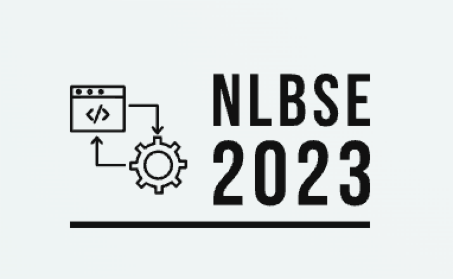

# NLBSE'23 Tool Competition on Issue Report Classification

## Introduction

The issue report classification competition consists of building and testing a multi-class classification model 
to classify issue reports as belonging to one category representing the type of information they convey.

We provide a dataset encompassing more than 1.4 million labeled issue reports 
(as bugs, enhancements, questions, and documentation) 
extracted from real open-source projects. 
You are invited to leverage this dataset for evaluating your classification approaches and compare the achieved results against proposed baseline approaches based on FastText and RoBERTa.

You must train, tune and evaluate your multi-class classification model(s) using the provided training and test sets.

> Please refer to our [tool competition page](https://nlbse2023.github.io/tools/) to read more about the tool competition and learn how to participate.

## Citing related work

Since you will be using our dataset (and possibly one of our notebooks) as well as the original work behind the dataset, please cite the following references in your paper:

```bibtex
@inproceedings{nlbse2023,
  author={Kallis, Rafael and Izadi, Maliheh and Pascarella, Luca and Chaparro, Oscar and Rani, Pooja},
  title={The NLBSE'23 Tool Competition},
  booktitle={Proceedings of The 2nd International Workshop on Natural Language-based Software Engineering (NLBSE'23)},
  year={2023}
}
```

```bibtex
@article{ticket-tagger-scp,
  author={Kallis, Rafael and Di Sorbo, Andrea and Canfora, Gerardo and Panichella, Sebastiano},
  title={Predicting issue types on GitHub},
  journal={Science of Computer Programming},
  volume={205},
  pages={102598},
  year={2021},
  issn={0167-6423},
  doi={https://doi.org/10.1016/j.scico.2020.102598},
  url={https://www.sciencedirect.com/science/article/pii/S0167642320302069}
}
```

## Dataset

A dataset of 1.4 million publicly-available issue reports is extracted.

Each issue report contains the following information:
- Label
- Id
- Title
- Body
- Author association

Each issue is labeled with one class that indicates the issue type, namely, `bug`, `feature`, `question` and `documentation`.

Issues that are labelled with synonyms of the above labels, as reported by [Izadi et al.](https://doi.org/10.1007/s10664-021-10085-3), are mapped to the original labels and included in the dataset.

Issues with multiple labels are excluded from the dataset.

The dataset only contains issues written in English.

The dataset is then split into a training set (90%) and a test set (10%).

The process of extracting the dataset is described in the [dataset notebook](1-Dataset.ipynb).

> The dataset has already been extracted to avoid costs on your end, please keep reading to find hyperlinks to both the training and test set.

## Training

You are provided a [training set](https://tickettagger.blob.core.windows.net/datasets/nlbse23-issue-classification-train.csv.tar.gz) encompassing more than 1.2 million labeled issue reports extracted from real open source projects.

Participants are free to select and transform variables from the training set as they please. Pretrained models are permitted but can only be finetuned on the given training set. Any inputs or features used to create or finetune the classifier, must be derived from the provided training set. Participants may preprocess, sample, apply over/under-sampling, select a subset of the attributes, perform feature-engineering, filter records, split the training set into a model-finetuning validation set, etc. Please contact us if you have any question about this.

The distribution of (1,275,881) issues in the training set is:
- bug:            670,951 (52.6%)
- feature:        472,216 (37%)
- question:        76,048 (6%)
- documentation:   56,666 (4.4%)

## Evaluation

Submissions are evaluated based on their class-detection performance over the provided [test set](https://tickettagger.blob.core.windows.net/datasets/nlbse23-issue-classification-test.csv.tar.gz). 
The classifier should assign one label to an issue.

The distribution of (142,320) issues in the test set:
- bug:	          74,781	(52.5%)
- feature:	      52,797	(37.1%)
- question:	       8,490	(6%)
- documentation:	 6,252	(4.4%)

The evaluation must be performed on the entire test set only. **Important:** you may apply any preprocessing or feature engineering on this dataset except sampling, rebalancing, undersampling or oversampling techniques.

Classification performance is measured using the F1 score over all the four classes (micro-averaged). 

A submission (i.e., paper) in the tool competition must provide:
- Precision, for each class and the micro average
- Recall, for each class and the micro average
- F1 score, for each class and the micro average

Micro-averaging was chosen as the cross-class aggregation method in this tool competition.

Please note that whilst all of the above measures must be provided for acceptance, the submissions will **only** be ranked by their F1 score.

## Baselines

Participants are encouraged, but not required, to use one of our baselines as template for their submission. Each template downloads the dataset, performs basic preprocessing, trains a classifier and evaluates it on the test set.

### [FastText](2-Template-fastText.ipynb)

| Label         | Precision | Recall | F1         |
| ------------- | --------- | ------ | ---------- |
| bug           | 0.8771    | 0.9173 | 0.8967     |
| feature       | 0.8415    | 0.8621 | 0.8517     |
| question      | 0.6702    | 0.4555 | 0.5424     |
| documentation | 0.7363    | 0.5011 | 0.5964     |
| micro average | 0.8510    | 0.8510 | **0.8510** |

Default hyperparameters were used. You can find the full list of hyperparameters [here](https://fasttext.cc/docs/en/python-module.html#train_supervised-parameters).

### [RoBERTa](3-Template-RoBERTa.ipynb)

| Label         | Precision | Recall | F1         |
| ------------- | --------- | ------ | ---------- |
| bug           | 0.9110    | 0.9390 | 0.9248     |
| feature       | 0.8950    | 0.8967 | 0.8958     |
| question      | 0.7309    | 0.5684 | 0.6395     |
| documentation | 0.7594    | 0.6975 | 0.7271     |
| micro average | 0.8906    | 0.8906 | **0.8906** |

| Hyperparameter | Value |
| -------------- | ----- |
| Max tokens     | 224   |
| Learning Rate  | 1e-5  |
| Batch size     | 64    |
| Epochs         | 5     |

Additional hypermeters have been not been changed from their default values. You can find the full list of hyperparameters [here](https://simpletransformers.ai/docs/usage/#configuring-a-simple-transformers-model).

> Note: the authors have used an RTX 3060 GPU to train the model.
